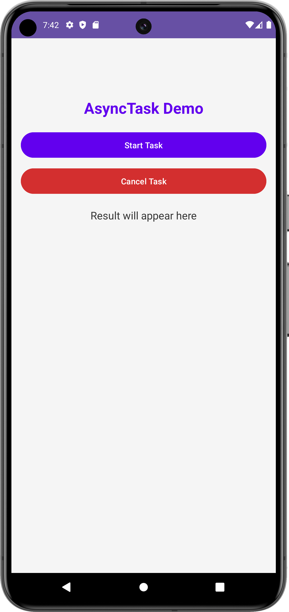
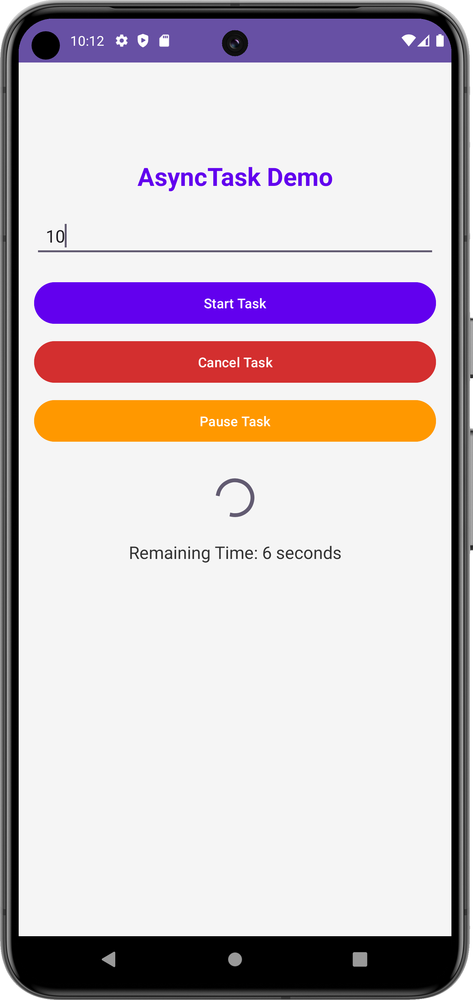
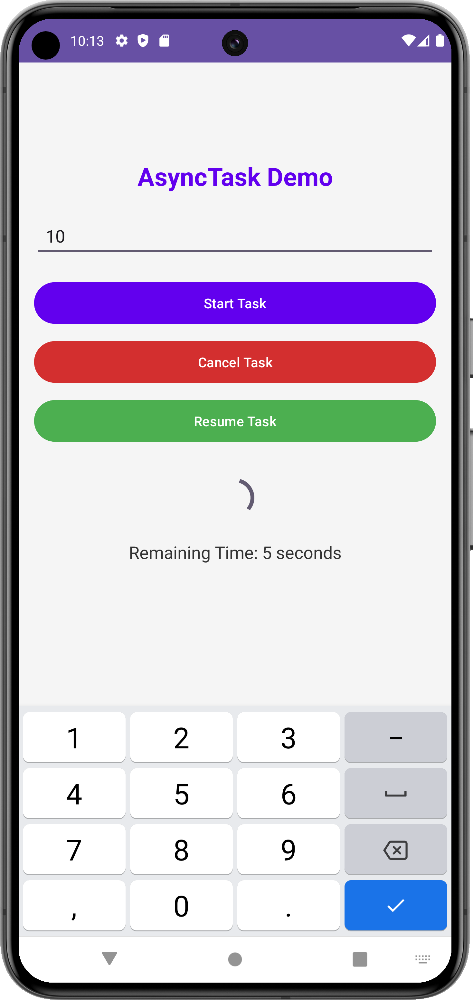

# AsyncTask Demo ⏳📱

<div style="display: flex; justify-content: center;">
    
    
    
</div>

## Description 🌟
This application demonstrates the use of `AsyncTask` in Android to run a background task, specifically a countdown timer with an interactive user interface. The app vibrates and plays a notification sound when the countdown finishes, and it allows users to pause, resume, and cancel the countdown.

## Features 🚀
- ⏰ Displays a customizable countdown based on user input (in seconds).
- 🚀 Buttons to start, pause, resume, and cancel the countdown.
- 📊 Progress bar to show the progress of the countdown.
- 🔔 Vibration and notification sound when the countdown is complete.
- 🎉 Lottie animation displayed after the countdown finishes.
- 🛠️ User-friendly interface with Snackbar notifications for better user experience.

## Prerequisites 📋
- Android Studio
- Android SDK 24 (Nougat) or higher
- Internet connection to download dependencies

## Installation ⚙️
1. Clone this repository:
   ```bash
   git clone https://github.com/username/repo-name.git
2. Open the project in Android Studio.
3. Wait for Android Studio to download all dependencies.
4. Run the application on an emulator or connected Android device.

## contributing 🤝
Contributions are welcome! If you have suggestions or improvements, please open an issue or submit a pull request.

## License 📄
This project is licensed under the MIT License. See the [LICENSE](LICENSE) file for details.

## Contact 📧
For any inquiries or feedback, feel free to reach out to me via:
- Email: himawanfirza21@gmail.com
- LinkedIn: Firza Himawan

